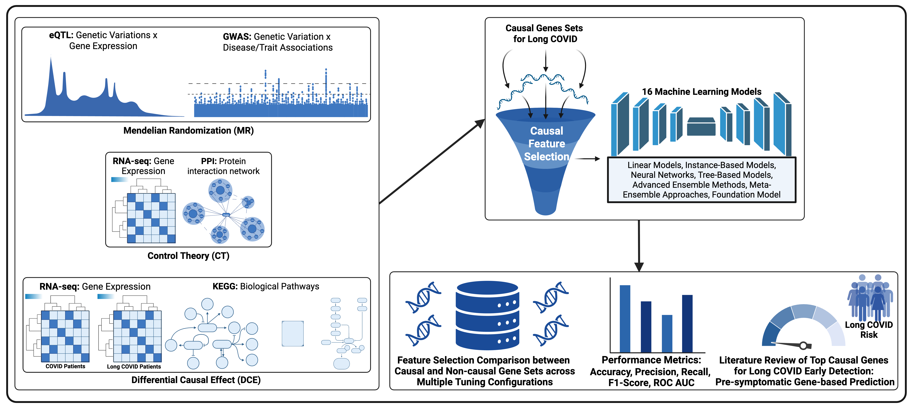

# Causal Machine‑Learning Framework for Early Detection of Long COVID

This repository hosts **all code, notebooks and supplementary material** required to reproduce the results reported in our paper:

> Piñero S *et al.* (2025) *Causal Machine‑Learning Framework for Early Detection of Long COVID* (CIKM ’25).

The Supplementary Materials (gene & pathway lists and full model metrics) are in `SM/`.

---

🧭 Project scope & methodology

> Long COVID, also known as Post-Acute Sequelae of COVID-19 (PASC), is a complex and debilitating condition characterized by the persistence or development of symptoms following SARS-CoV-2 infection that significantly impacts 10–40% of COVID-19 survivors worldwide ([BMC Infectious Diseases, 2025](https://bmcinfectdis.biomedcentral.com/articles/10.1186/s12879-025-10805-w)).

🔎 Gaps we address
- No reliable early‑warning biomarkers. Existing models rely on symptoms, so risk is flagged only after clinical damage has begun.
- Associational (non‑causal) prediction dominates. Most studies cannot disentangle correlation from mechanism, hampering targeted interventions.
- Transcriptomic signals remain under‑used. Few prediction efforts exploit the molecular perturbations that precede symptom onset.
- Low interpretability. Black‑box classifiers offer limited insight into why a patient is predicted to develop Long COVID.

🎯 Our goals
- Detect risk pre‑symptomatically using whole‑blood RNA‑seq profiles.
- Uncover mechanistic drivers via Differential Causal Effects (DCE) that pinpoint pathways whose activity changes causally from acute to Long COVID.
- Deliver accurate, tabular deep‑learning predictions with the foundation model TabPFN, seeded with these causally selected features.
- Retain interpretability by mapping each prediction back to pathway‑level effects quantified by DCE.
- Provide an end‑to‑end, reproducible toolkit (R + Python) that clinicians and researchers can execute in two steps.

The figure below summarises the workflow.



We implement the framework as a two‑stage pipeline:
1. **Selects biologically grounded transcriptomic features** using *Differential Causal Effects* (DCE) between Long COVID and acute COVID (R script DCE.R; dataset‑wide summary results in sm/SM1_DCE_Significant_Genes_Pathways_COVID_LC.xlsx).
2. **Benchmarks 16 classical tabular classifiers + TabPFN** on both DCE genes and an orthogonal “most‑variable‑gene” (MVG) baseline, using stratified cross‑validation and rigorous hyper‑parameter grids (see ML_Models.ipynb for the code and sm/SM2_Early_Detection_LC.pdf for more info).

Outputs: fold‑wise metric CSVs, summary CSVs and figures stored in results/. Comparative plots and full metric tables appear in sm/SM2_Early_Detection_LC.pdf.

---

## 🗄️ Data

RNA‑seq counts (Ensembl GRCh37) and minimal clinical phenotypes are publicly available from **GEO‑NCBI accession [GSE215865](https://www.ncbi.nlm.nih.gov/geo/query/acc.cgi?acc=GSE215865)**.
Download `counts.txt.gz` and `sample_sheet.txt` (≈ 850 MB) and place them in `data/`.

---

## 🔧 Code & notebook overview

| File / Module                  | Purpose                                                                                         |
| ------------------------------ | ----------------------------------------------------------------------------------------------- |
| `DCE.R`                        | Computes Differential Causal Effects, outputs ranked gene/pathway lists (used to build SM1)     |
| `dce_selection.py`             | Python wrapper that reads DCE output and returns the 411 top genes for model pipelines          |
| `ML_Models.ipynb`              | Quality control, NA imputation (mean per gene), subject‑level aggregation + 16 classical classifiers plus TabPFN with metrics results + plots  |

- All model hyper‑parameters correspond exactly to those reported in **Supplementary Material 2**.

---

## 📚 Citing

If you use this code, please cite:

```bibtex
@inproceedings{pinero2025,
  author    = {Piñero, Sindy L. and Duong, Thi N. N. and Li, Xiaomei and et al.},
  title     = {Causal Machine Learning Framework for Early Detection of Long COVID},
  booktitle = {Proc. 34th ACM Int. Conf. on Information and Knowledge Management},
  year      = {2025}
}
```

---

## 🤝 License & contact

Distributed under the MIT License.
Open an issue or email [pinsy007@mymail.unisa.edu.au](mailto:pinsy007@mymail.unisa.edu.au) for questions.
